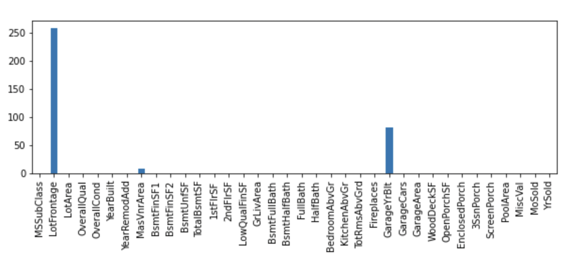
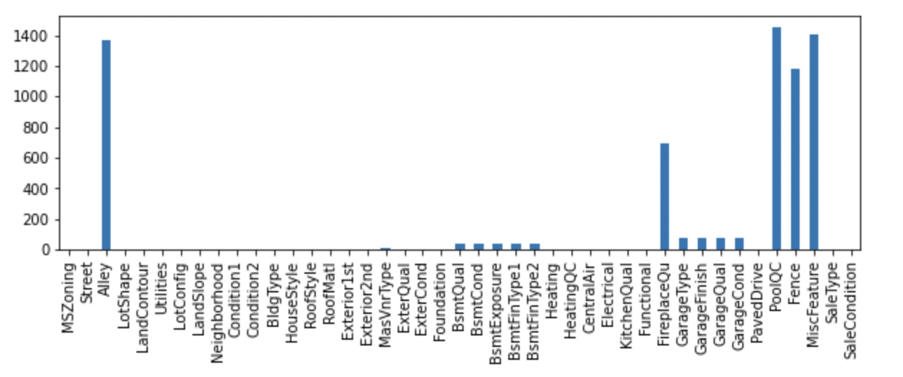
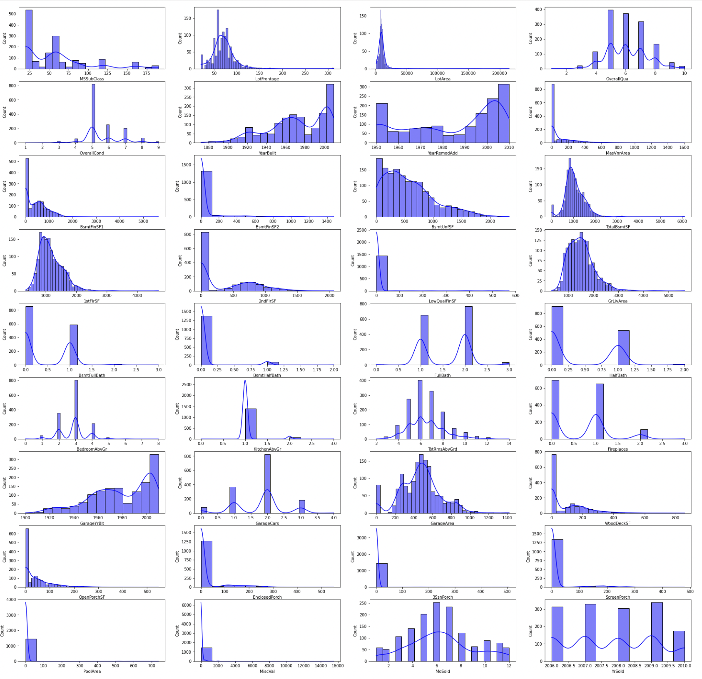
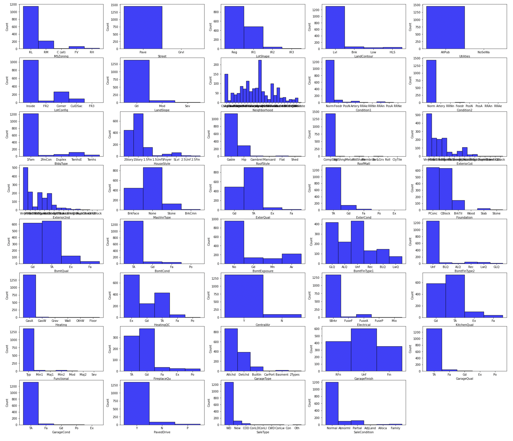
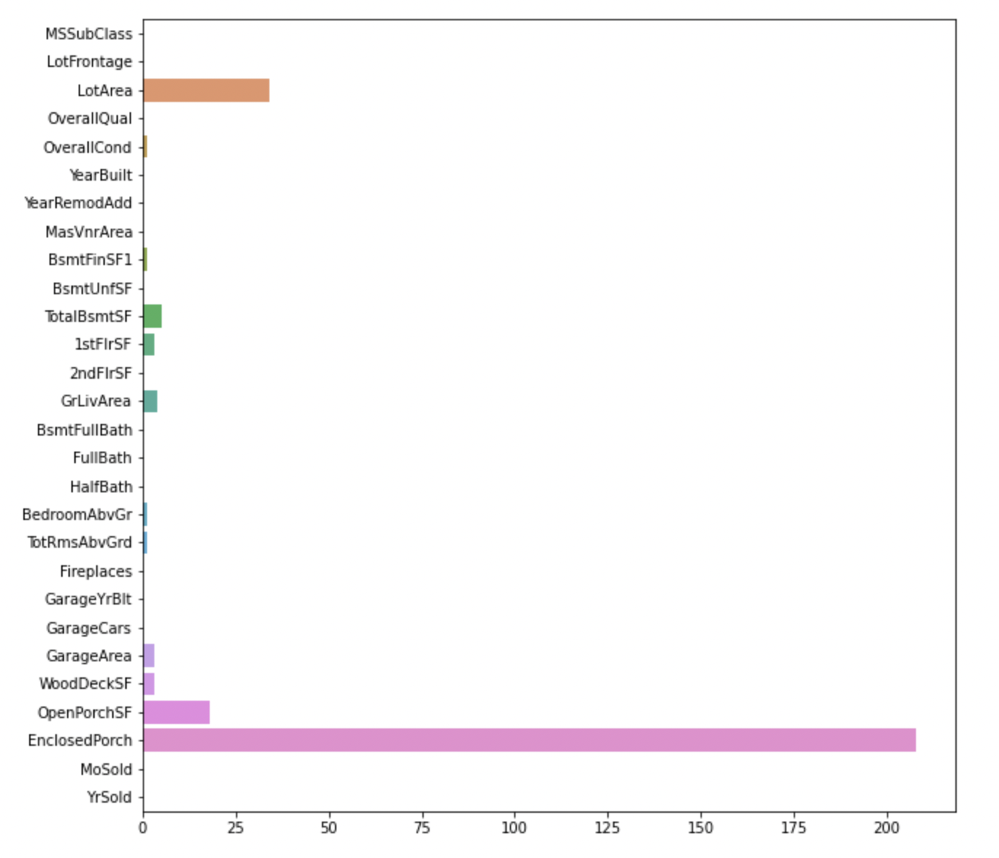
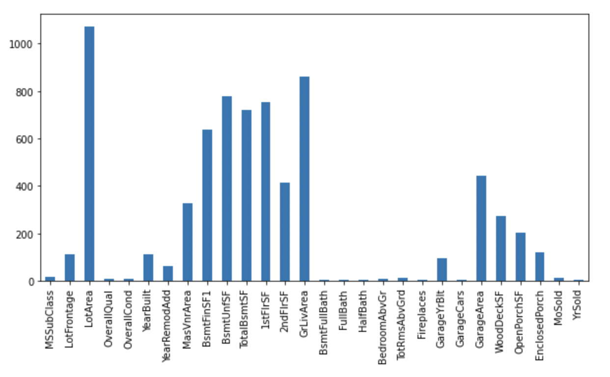

# House_Selling_Price_Prediction
Kaggle Competetion. [More details can be found here] (https://www.kaggle.com/competitions/home-data-for-ml-course/submissions)

Steps :
* Exploratory Data Analysis (EDA)
    * Structure Investigation 
        | Structural Parameters     | Values |
        | Number of Entries         | 1460   |
        | Number of Features        | 79     |
        | Number of Float Features  | 3      |
        | Number of Int64 Features  | 33     |
        | Number of Object Features | 43     |

    * Splitting the data into Numerical and Categorical columns. 
        | Number of Numerical Columns |  Categorical Columns  |
        |              36             |       43              |

    * Checking for duplicates and removing them if any
        * There exist no duplicates in the train dataset. 

    * Checking for Null Values
        * Numerical Columns 
             

        * Categorical Columns 
             

            * Columns with more than 70% null values ['Alley', 'PoolQC', 'Fence', 'MiscFeature'] are removed. 

    * Histograms
        * Numerical Columns 
            
            * Highly skewed discrete Numerical Columns such as ['LowQualFinSF', 'PoolArea', '3SsnPorch', 'ScreenPorch', 'MiscVal', 'KitchenAbvGr', 'BsmtFinSF2', 'BsmtHalfBath'] have been dropped. 

        * Categorical Columns 
            
            * Highly skewed discrete Categorical Columns such as ['Street', 'Utilities', 'RoofMatl', 'Condition2', 'LandSlope', 'Electrical',
                   'BsmtCond', 'Heating', 'Functional', 'GarageQual', 'GarageCond', 'CentralAir', 'PavedDrive'] have been dropped. 
    
    * Outliers 
        * Numerical Columns
            * Inter Quartile Range (IQR) = 75 percentile - 25 percentile
            * Outlier < mean - 3 * IQR or Outlier > mean + 3 * IQR
            

    * Number of Unique Values in each column
        * Numerical Columns
            

        * Categorical Columns 
            
    

* Feature Engineering using [ColumnTransformer](https://scikit-learn.org/stable/modules/generated/sklearn.compose.ColumnTransformer.html)
    * Replcaing Null Values
        * Numerical Columns 
            * Median replacement
        * Categorical Columns
            * Mode or Most frequent replacement
    * Categorical Value Encoding
        * Ordinal (Label) Encoding is used. 

    * Scaling 
        * Log transformations on the skewed numerical columns such as ['LotArea', 'GarageArea', 'EnclosedPorch', 'LotFrontage', 'MasVnrArea', 'WoodDeckSF', 'OpenPorchSF']

        * Standardization using Standard Scaler on other continuous numerical columns. 
    
* Training 
    * Model : [XGB Regressor](https://xgboost.readthedocs.io/en/stable/python/python_api.html?highlight=xgbregressor#xgboost.XGBRegressor)
    * Paramters tried using [GridSearchCV](https://scikit-learn.org/stable/modules/generated/sklearn.model_selection.GridSearchCV.html)

        | Hyper Parameters  | Values                         |
        | n_estimators      | [150, 200, 250, 300, 350, 400] |
        | learning_rate     | [0.1, 0.15, 0.2, 0.25]         |
        | max_depth         | [4, 5, 6, 7, 8, 9]             |

    * Best Parameters Found : 

        | learning_rate | max_depth | n_estimators |
        |  0.1          |     5     |    150       |

***For any queries or suggestions, Please feel free to contact me on LinkedIn or on email***
***Thank you***          
