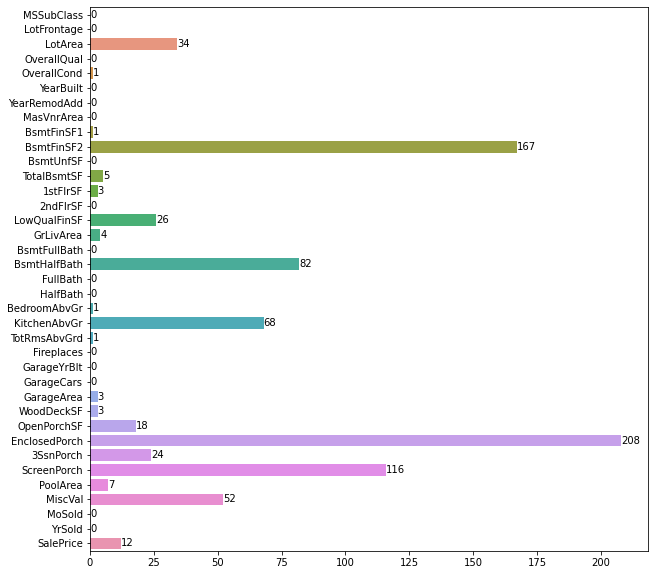
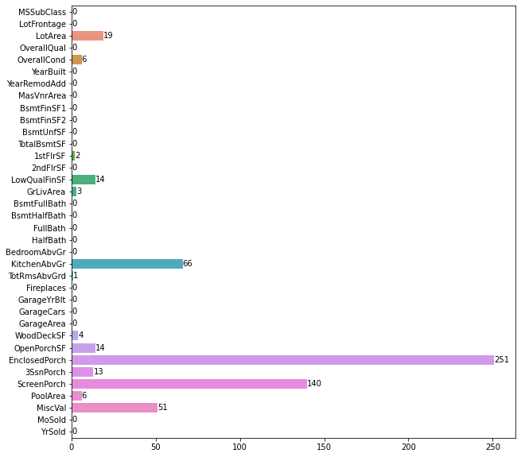
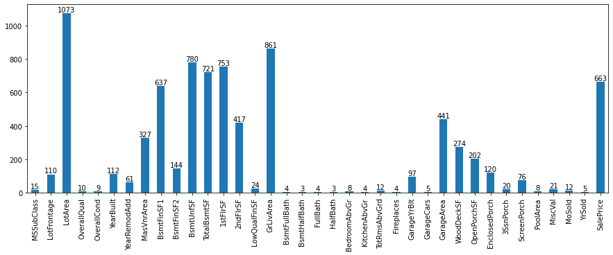
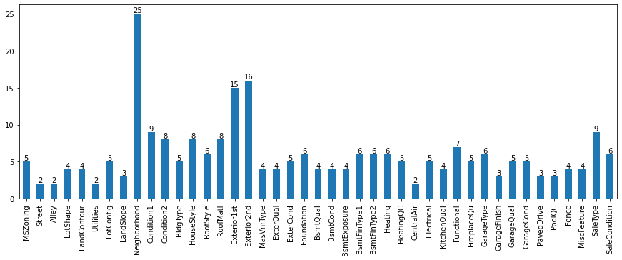
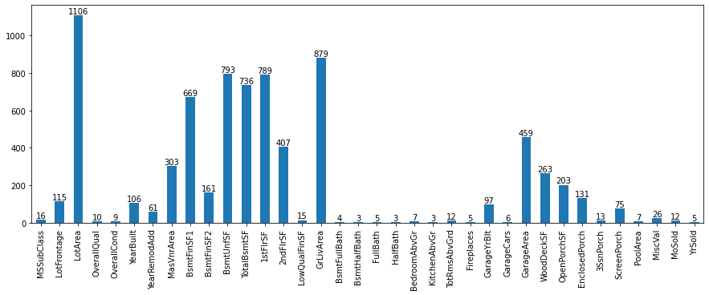
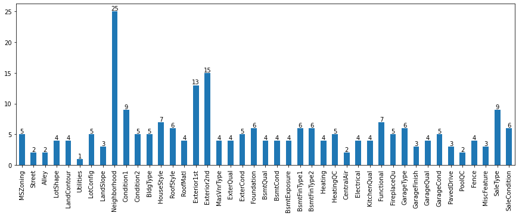
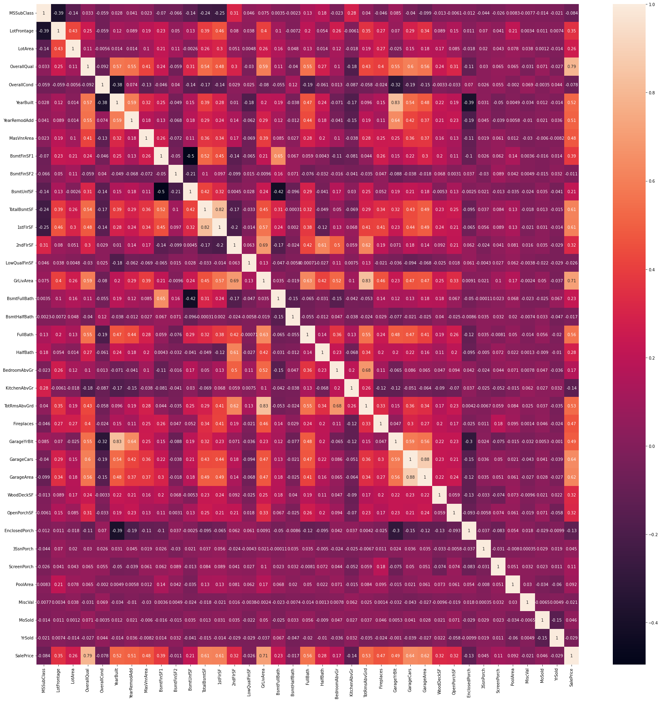

# House_Selling_Price_Prediction

* Basic Introduction: Machine Learning Kaggle Competetion containing all the required details in csv file format to predict the price of the house. 
* [More details can be found here](https://www.kaggle.com/competitions/home-data-for-ml-course/submissions)

## Who should go through this repo 

* If you are new to ML coding 
* If you are new to Kaggle Projects
* If you want check out, how to use [Pipeline](https://scikit-learn.org/stable/modules/generated/sklearn.pipeline.Pipeline.html) and [ColumnTransformer](https://scikit-learn.org/stable/modules/generated/sklearn.compose.ColumnTransformer.html) in your ML projects. 

## Files 

* Dataset - Contains all the csv files downloaded from Kaggle (link mentioned above). 
* EDA.ipynb - Exploratory Data Analysis of train.csv and test.csv files. 
* Feature_Engineering.ipynb - Categorizing the columns and some of my own experimentation (optional).
* Pipeline.ipynb - Final Training and Testing pipeline (Used Column Transformer and Pipelines from sklearn)
* Images - Contains all the plots generated in EDA
* Kaggle Submissions -- Some of my kaggle submission csv files. 

## How to go through this repo 

* Read the whole README.md file. 
    * I have summarized the EDA in this file. 
* EDA.ipynb - If you want to learn how to generate plots in readme file.
* Feature_Engineering.ipynb can be skipped. 
* Pipeline.ipynb - If you want to learn how to use ColumnTransformers, Pipeline (sklearn) and write end to end ML code for prediction on test dataset.  

## Exploratory Data Analysis (EDA)

* Structure Investigation 

    | Structural Parameters     | Train Data | Test Data |
    | --------------------------|------------|-----------|
    | Number of Entries         | 1460       | 1459      |
    | Number of Features        | 79         | 79        |
    | Number of Float Features  | 3          | 11        |
    | Number of Int64 Features  | 33         | 25        |
    | Number of Object Features | 43         | 43        |

* Splitting the data into Numerical and Categorical columns. 

    | Total number        | Train | Test |
    | --------------------|-------|------|
    | Numerical Columns   |  36   | 36   |
    | Categorical Columns |  43   | 43   |

* Checking for duplicates and removing them if any
    * There exist no duplicates in the train dataset. 

* Checking for Null Values
    * Null values distribution of Numerical Columns in train dataset.
         

    * Null values distribution of Categorical Columns in train dataset.
        
    
    * Null values distribution of Numerical Columns in test dataset.
         

    * Null values distribution of Categorical Columns in test dataset.
        

* Histograms

    * Histograms of Numerical Columns in train dataset
        
    
    * Histograms of Categorical Columns in train dataset
        

    * Histograms of Numerical Columns in test dataset
        
    
    * Histograms of Categorical Columns in test dataset
        

* Skewness 
    | Dataset | Features type | Features |
    |--------- | ------------- | --------- |
    | Train | Numerical | ['LowQualFinSF', '3SsnPorch', 'LotArea', 'PoolArea', 'MiscVal'] |
    | Train | Categorical | ['Street', 'Utilities', 'Condition2', 'RoofMatl', 'Heating'] |
    | Test | Numerical | ['3SsnPorch', 'LowQualFinSF', 'MiscVal', 'PoolArea'] |
    | Test | Categorical | ['Street', 'Utilities', 'Condition2', 'RoofMatl', 'Heating'] |

    * Numerical Columns 
        * Skewness in numerical features can be reduced by applying mathematical transformations.

    * Categorical Columns 
        * Categorical skewed columns can be removed. 

* Outliers 
    * Numerical Columns
        * Inter Quartile Range (IQR) = 75 percentile - 25 percentile
        * Outlier < mean - 3 * IQR or Outlier > mean + 3 * IQR
        * Outliers distribution of all Numerical Columns in train dataset. 
        

        * Outliers distribution of all Numerical Columns in test dataset. 
        
    
    | Dataset | Features type | Features |
    |--------- | ------------- | --------- |
    | Train | Numerical | ['LotArea', 'OverallCond', 'BsmtFinSF1', 'BsmtFinSF2', 'TotalBsmtSF', '1stFlrSF', 'LowQualFinSF', 'GrLivArea', 'BsmtHalfBath', 'BedroomAbvGr', 'KitchenAbvGr', 'TotRmsAbvGrd', 'GarageArea', 'WoodDeckSF', 'OpenPorchSF', 'EnclosedPorch', '3SsnPorch', 'ScreenPorch', 'PoolArea', 'MiscVal', 'SalePrice'] |
    | Test | Numerical | ['LotArea', 'OverallCond', '1stFlrSF', 'LowQualFinSF', 'GrLivArea', 'KitchenAbvGr', 'TotRmsAbvGrd', 'WoodDeckSF', 'OpenPorchSF', 'EnclosedPorch', '3SsnPorch', 'ScreenPorch', 'PoolArea', 'MiscVal']|

* Number of Unique Values in each column
    * Unique values distribution of Numerical Columns in train dataset.
        

    * Unique values distribution of Categorical Columns in train dataset.
        

    * Unique values distribution of Numerical Columns in test dataset.
        

    * Unique values distribution of Categorical Columns in test dataset.
        

* HeatMaps
    * Correlation of each feature with other features. 
        
    * Positively Correlated Features - ['SalePrice', 'OverallQual', 'GrLivArea', 'GarageCars', 'GarageArea', 'TotalBsmtSF', '1stFlrSF']
    * Negatively Correlated Features - ['KitchenAbvGr', 'EnclosedPorch', 'MSSubClass', 'OverallCond', 'YrSold', 'LowQualFinSF', 'MiscVal', 'BsmtHalfBath', 'BsmtFinSF2']

## Feature Engineering using [Pipeline](https://scikit-learn.org/stable/modules/generated/sklearn.pipeline.Pipeline.html) and [ColumnTransformer](https://scikit-learn.org/stable/modules/generated/sklearn.compose.ColumnTransformer.html)

| Type | Features | Transformation Applied |
|--------- | ------------- | --------- |
| Skewed Continuous | ['LowQualFinSF', '3SsnPorch', 'LotArea', 'PoolArea', 'MiscVal'] | Imputation with median, Log Transformation, Standardization |
| Non Skewed Continuous | ['1stFlrSF', 'BsmtHalfBath', 'BsmtFinSF2', 'EnclosedPorch', 'BsmtFinSF1', 'GarageArea', 'WoodDeckSF', 'GrLivArea', 'KitchenAbvGr', 'MasVnrArea', '2ndFlrSF', 'ScreenPorch', 'OpenPorchSF', 'LotFrontage', 'TotalBsmtSF', 'BsmtUnfSF'] | Imputation with median, Standardization |
| Discrete Numerical | ['MSSubClass', 'OverallQual', 'OverallCond', 'YearBuilt', 'YearRemodAdd',  'BsmtFullBath', 'FullBath', 'HalfBath', 'BedroomAbvGr', 'TotRmsAbvGrd', 'Fireplaces', 'GarageYrBlt', 'GarageCars', 'MoSold', 'YrSold'] | Imputation with mode, 
| Categorical | ['MSZoning', 'Alley', 'LotShape', 'LandContour', 'LotConfig', 'LandSlope', 'Neighborhood', 'Condition1', 'BldgType', 'HouseStyle', 'RoofStyle', 'Exterior1st', 'Exterior2nd', 'MasVnrType', 'ExterQual', 'ExterCond', 'Foundation', 'BsmtQual', 'BsmtCond', 'BsmtExposure', 'BsmtFinType1', 'BsmtFinType2', 'HeatingQC', 'CentralAir', 'Electrical' 'KitchenQual', 'Functional', 'FireplaceQu', 'GarageType', 'GarageFinish', 'GarageQual', 'GarageCond', 'PavedDrive', 'PoolQC', 'Fence', 'MiscFeature', 'SaleType', 'SaleCondition'] | Imputation with mode, OneHotEncoding|

## Training using [Sklearn Pipeline](https://scikit-learn.org/stable/modules/generated/sklearn.pipeline.Pipeline.html)

* Train-Val Split : Splitting into training(80%) and validation sets (20%).

* Model : [XGB Regressor](https://xgboost.readthedocs.io/en/stable/python/python_api.html?highlight=xgbregressor#xgboost.XGBRegressor)
* Paramters tried using [GridSearchCV](https://scikit-learn.org/stable/modules/generated/sklearn.model_selection.GridSearchCV.html)

    | Hyper Parameters  | Values                         |
    | ------------------|--------------------------------|
    | n_estimators      | [150, 200, 250, 300, 350, 400] |
    | learning_rate     | [0.1, 0.15, 0.2, 0.25]         |
    | max_depth         | [4, 5, 6, 7, 8, 9]             |

* Best Parameters Found

    | learning_rate | max_depth | n_estimators |
    | ------------- | ----------| -------------|
    |  0.1          |     4     |    400       |

* Results 

    | Dataset    | Mean Squared error | R2 score |
    | -----------|--------------------| -------- |
    | Train      |        0.0006      |  0.9959  | 
    | Validation |        0.023       |  0.8625  | 

## Kaggle Submission 

| Mean squared error | Rank | 
| ------------- | ----------|
|  14701.79191  |  918      | 

## Future Directions 

* One can still work on improving the results on this dataset. 
* I would like to recommend one to go through this repo entirely, understand the code, reproduce the results, go through better feature engineering techinques, apply them and try to boost your rank on the Kaggle leaderboard. 

***For any queries or suggestions, Please feel free to contact me on LinkedIn or on email*** \
***Please do give a star, if this is helpful*** \
***Thank you***          
